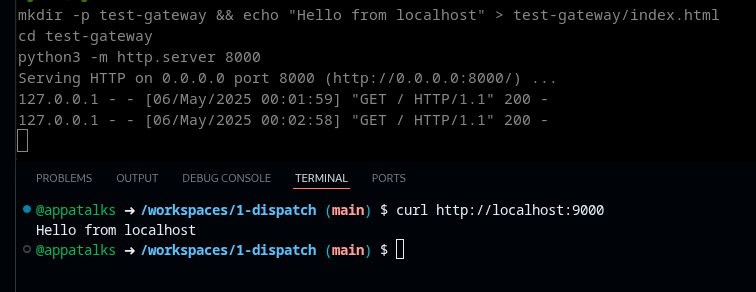

# gh-cs-proxy
### GitHub Cli Extension: Proxy-Gateway & VPN for Codespaces <p><p>

Send chosen internet traffic through your GitHub Codespace with [`sshuttle`](https://github.com/sshuttle/sshuttle/), and optionally open a reverse SSH tunnel so the Codespace can reach services running on your local machine.


 <p> Using with: `$ gh cs-proxy connect my-codespace --gateway`

<br>
 
> [!NOTE]
> This extension aims to have similar functionality as described in this no longer maintained GH CLI [Extension](https://docs.github.com/en/codespaces/developing-in-a-codespace/connecting-to-a-private-network#using-the-github-cli-extension-to-access-remote-resources):
>
> `.. allows you to create a bridge between a codespace and your local machine, so that the codespace can access any remote resource that is accessible from your machine. The codespace uses your local machine as a network gateway to reach those resources.`

> [!NOTE]
> Not reviewed for production use.

## Installation

```bash
gh extension install appatalks/gh-cs-proxy
chmod +x ~/.local/share/gh/extensions/gh-cs-proxy/gh-cs-proxy
```

## Usage

```bash
gh cs-proxy connect <codespace-name> [flags]
```

## Flags

`--all`             Route all traffic (0.0.0.0/0) through the Codespace

`--only-443`        Route only HTTPS/TLS traffic (0.0.0.0/0:443)

`--dns`             Include DNS queries in the tunnel

`--domains "..."`  Route HTTPS traffic for specific domains (space-separated list)

`--gateway`         Set up a reverse SSH tunnel so the Codespace can reach your localhost (default local:8000 → remote:9000)

`-h`, `--help`      Show usage

## Examples

1. Route only TLS + DNS:
  ```bash
  gh cs-proxy connect my-codespace --only-443 --dns
  ```

2. Route GitHub domains + set up local gateway:
  ```bash
  gh cs-proxy connect my-codespace --domains "github.com api.github.com" --gateway
  ```

3. Route all traffic:
  ```bash
  gh cs-proxy connect my-codespace --all
  ```

4. Custom local port mapping (optionally, use env vars before running):
  ```bash
  export LOCAL_PORT=3000 REMOTE_PORT=9001
  gh cs-proxy connect my-codespace --gateway
  ```
<br>

 ###### `Appa's Thoughts: Epic.`
